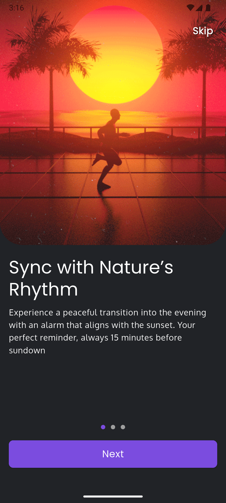
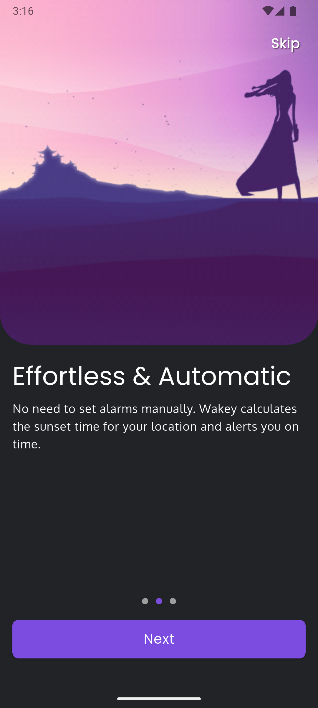
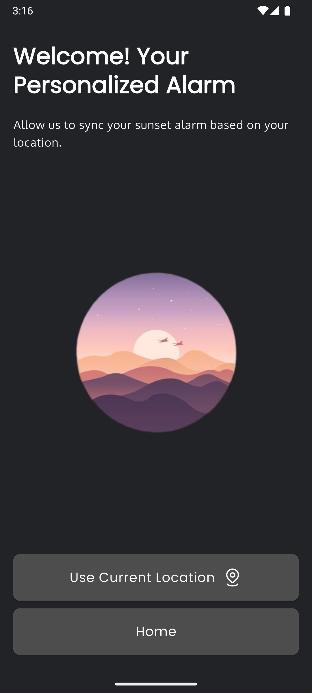
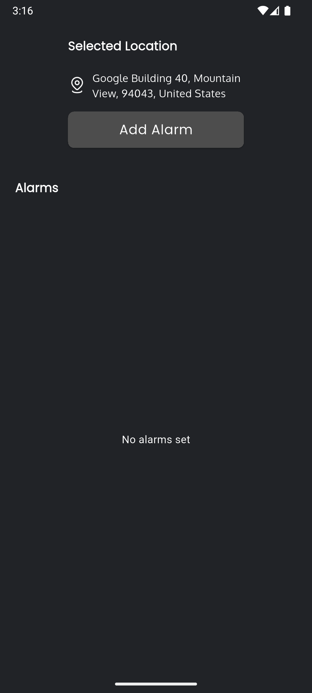
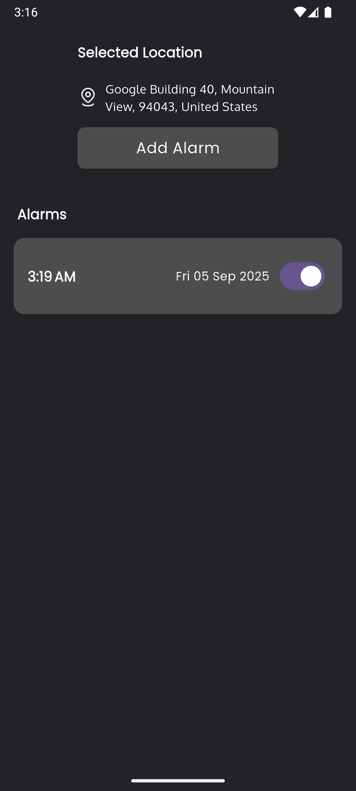

## Overview
This project was developed as part of a technical assessment for a Junior Flutter Developer position.

## Features
-  Modern UI with Material Design 3
-  Location-based services integration
-  Custom alarm functionality
-  Local notifications
-  Persistent storage using Hive
-  State management with Provider

## Project Structure
```
lib/
├── common_widgets/
│   └── custom_button.dart
├── constants/
│   ├── assets.dart
│   ├── colors.dart
│   └── strings.dart
├── features/
│   ├── home/
│   │   └── homepage.dart
│   ├── location/
│   │   ├── location_page.dart
│   │   └── providers/
│   │       └── location_provider.dart
│   └── onboarding/
│       └── onboarding_page.dart
├── helpers/
│   ├── alarm_helper.dart
│   ├── formatting_helper.dart
│   ├── hive_helper.dart
│   └── notification_helper.dart
├── networks/
│   └── location_service.dart
└── main.dart
```

## Tools & Technologies Used

### Core
- Flutter (Latest Stable Version)
- Dart SDK: ^3.9.0

### State Management
- Provider: ^6.1.5+1

### Storage
- Hive: ^2.2.3
- Hive Flutter: ^1.1.0
- SharedPreferences: ^2.5.3

### Location Services
- Geolocator: ^14.0.2
- Geocoding: ^4.0.0
- Permission Handler: ^12.0.1

### Notifications & Alarms
- Flutter Local Notifications: ^19.4.1
- Alarm: ^5.1.4
- Timezone: ^0.10.1

### UI/UX
- Google Fonts: ^6.3.1
- Cupertino Icons: ^1.0.8
- Intl: ^0.20.2 (For date/time formatting)

### Utilities
- Path Provider: ^2.1.5
- UUID: ^4.5.1

## Setup Instructions

1. Clone the repository:
```bash
git clone https://github.com/kaiumallimon/softvence--assessment--flutter.git
```

2. Navigate to project directory:
```bash
cd softvence--assessment--flutter
```

3. Install dependencies:
```bash
flutter pub get
```

4. Run the app:
```bash
flutter run
```

### Required Permissions
- Location (For geolocation features)
- Notifications (For alarm notifications)
- Background execution (For alarm functionality)

## Screenshots

### Onboarding & Location Access



### Main Interface



### Alarm Features



## Architecture & Design Patterns

### Clean Architecture
The project follows a feature-first architecture pattern, separating concerns into:
- Features (Presentation layer)
- Services (Business logic layer)
- Helpers (Data/Utility layer)

### State Management
- Used Provider for efficient and scalable state management
- Implemented reactive programming patterns for location updates

### Code Quality
- Followed Flutter's official style guide
- Implemented proper error handling
- Used constants for maintainability
- Organized imports and dependencies

## What I Learned
Through this assessment, I demonstrated my ability to:
- Implement complex Flutter features like location services and notifications
- Work with local storage solutions
- Handle platform permissions
- Create a clean and maintainable project structure
- Follow Flutter best practices and patterns


